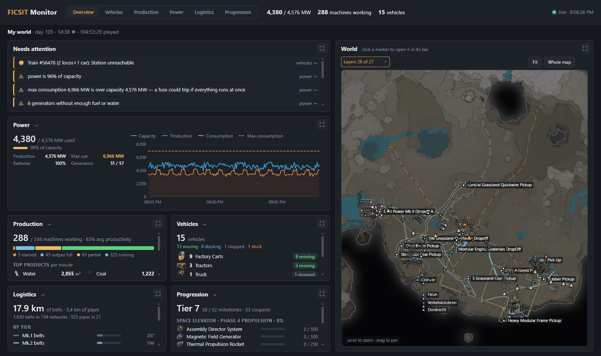
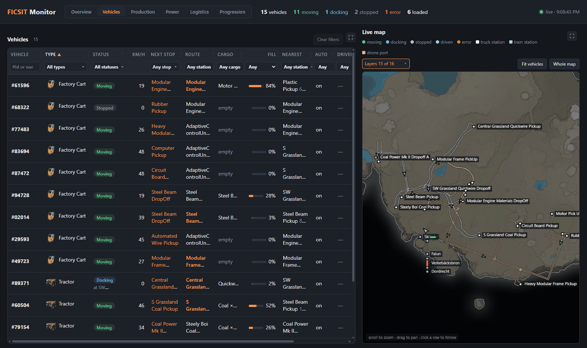
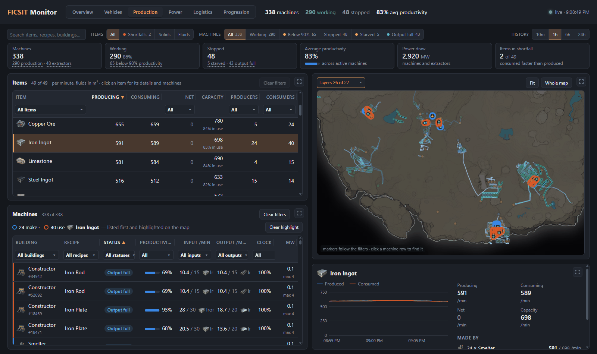
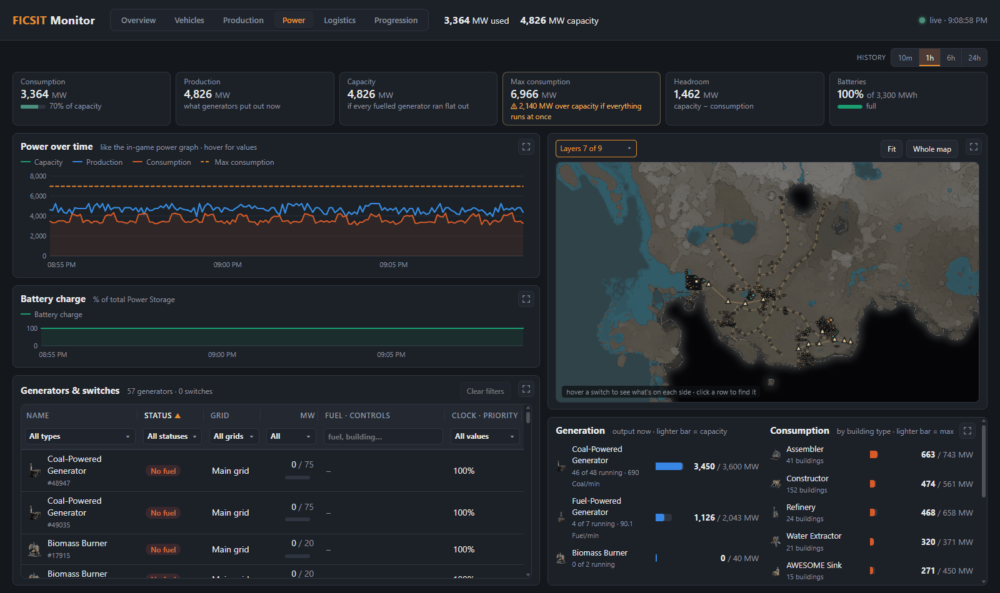
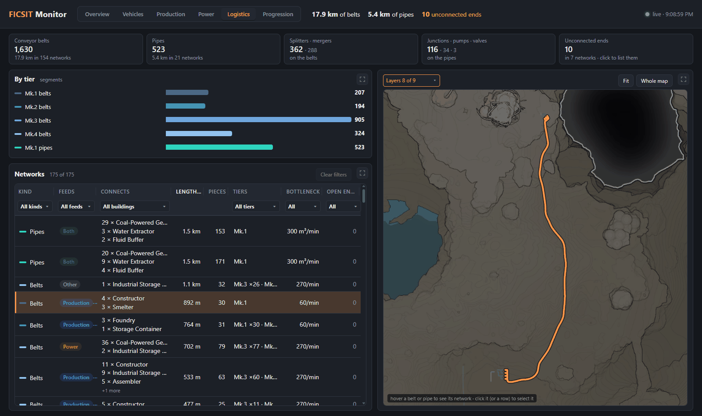
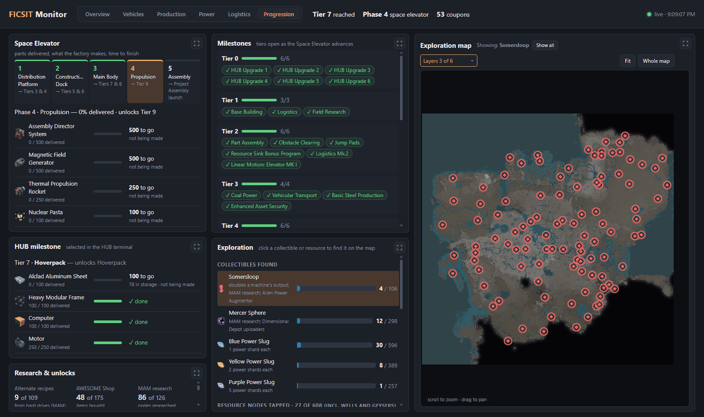

# Ficsit Remote Monitoring – FICSIT Monitor

A live web dashboard for a Satisfactory world: how the factory is doing at a glance, every vehicle, every production machine, the power grid, every conveyor belt and pipe, and your progression. It reads data from the [Ficsit Remote Monitoring](https://github.com/porisius/FicsitRemoteMonitoring) (FRM) mod's web API.



## Tabs

### Overview (home)
- **Needs attention**: an overloaded grid or tripped fuse, max consumption over capacity, generators out of fuel or water, starved machines, items used faster than they're made, stuck vehicles (derailed, station unreachable, …), unconnected belt/pipe ends, milestones ready to unlock, coupons to spend. Each links to the tab that explains it.
- **Summary cards**: power across the top (key figures and the four-line power chart), then production (status mix, top products, shortfalls), vehicles (per type, stuck ones by name), logistics (belt and pipe totals by tier) and progression (Space Elevator and HUB parts).
- **World map** of machines, generators, vehicles, players, the HUB, the Space Elevator, every belt and pipe, the power network (lines, poles, wall outlets, towers, switches, power storage), roads, rail, drone routes and truck / train stations, with a categorized Layers dropdown.

### Vehicles

- **Table of every vehicle**: factory carts, tractors, trucks, fluid trucks, explorers, Cyber Wagons, trains and drones, with status (moving, docking, stopped, driven, error), speed, next stop, route, cargo, fill level, nearest station, autopilot and driver. A filter under every column; station and cargo filters are searchable multi-selects.
- **Live map** with smoothly moving markers. Hover a vehicle to highlight its stops; hover a station to see what's in it; click a row to follow a vehicle.

### Production

- **Items**: producing, consuming and net per minute for every item (generators' fuel and water included), capacity and how much of it is in use. Click an item to see its history and highlight the machines that make (blue) and use (orange) it, in the table and on the map.
- **Machines**: status (running, partial, starved, output full, paused, no power), productivity, input and output, clock speed, power shards, Somersloops and power draw. A filter under the columns (building, recipe, status, productivity, inputs, outputs, clock); click a row to find the machine on the map.
- The summary tiles are shortcuts: click "5 starved" to see those five.

### Power

- **All grids** together or one grid at a time. Grids are named after what powers them, biggest share first, with used / max: "Nuclear 200/2,000 MW", "Coal 1", "Coal 2"; grids with no generators come last.
- The in-game power graph's numbers (capacity, production, consumption, max consumption) plus headroom, batteries and fuse state, with history charts.
- **Generators & switches** in one table, with a filter under every column: each generator's output, fuel and water; each power switch's state, priority group (Undefined turns off first, then 8 … 1), what it's fed from and what it controls. Hover a switch to see its two sides on the map (supply blue, controlled orange).
- **Grid layout**: each grid's sections, following the switches out from the generators.
- Generation by generator type and consumption by building type, beside a map of the power network: lines, poles, wall outlets, towers, switches and power storage, with the selected grid bright and the rest faded.

### Logistics

- Every conveyor belt and pipe, grouped into **networks** (belts or pipes that connect to each other), with totals, segments by tier, splitters/mergers and junctions/pumps/valves, and unconnected ends.
- **Networks table**: what each network feeds (production, power), the buildings it connects, its length, tier mix and bottleneck (the slowest tier), and open ends, with a filter under the columns.
- Hover a belt or pipe on any map to see its tier and speed and its network; click one (or a row) to highlight the whole network.
- FRM doesn't say what a belt or pipe connects to, so `server.py` works the networks out from geometry (ends that meet, shared splitters/mergers/junctions/pumps, conveyor lifts), and a network counts as production or power if it reaches a machine or a generator. It doesn't know what's on a belt or how full it is.

### Progression

- Space Elevator phase with each part's delivered amount, how many are in storage, how fast the factory makes them and time to finish; the HUB's active milestone; milestones per tier; MAM research; alternate recipes, AWESOME Shop and coupons.
- Collectibles found (Somersloops, Mercer Spheres, power slugs) and resource nodes tapped. Click one to find the ones still out there on the map.

### Everywhere
- Every map has a **Layers** dropdown, X/Y coordinates under the cursor, and shows players (online and offline). **Right-click** a map to open the same spot, at the same zoom, in another tab's map. The Production map shows the belts and pipes of production lines; the Overview and Logistics maps show them all.
- Every table has its title and row count on the left, **Clear filters** on the right, and filters under the column headings.
- Every panel has a **full-screen** button (Esc to close). Table columns can be resized (double-click an edge to fit) and sorted.
- On a desktop browser each tab fits one screen; on phones the panels stack.
- `server.py` records power and production history (every 5 s / 15 s, 24 hours kept, saved to `history.json`), so charts have data from before the page was opened, and works out the belt and pipe networks every minute.

## Requirements
- Satisfactory 1.2 with the **Ficsit Remote Monitoring** mod, with its web server started (`/frm http start` in game chat, or its autostart setting turned on).
- Python 3.9+ (standard library only; [Pillow](https://pypi.org/project/pillow/) is optional, for resizing pictures).
- For route, next-stop, live-position and speed data, FRM needs the vehicle fixes from [porisius/FicsitRemoteMonitoring#310](https://github.com/porisius/FicsitRemoteMonitoring/pull/310). With an FRM build that lacks them, the dashboard still runs, but vehicles show no routes and stay frozen whenever no player is nearby. Power poles, wall outlets and power towers on the maps also need that pull request's `getPowerPoles` endpoint; without it, the power lines and switches still show.

## Setup
```sh
# one time: map image (from your FRM install), vehicle pictures and item/building icons (from the Satisfactory wiki)
python tools/fetch_assets.py --game-dir "<path to Satisfactory or SatisfactoryDedicatedServer>"

# run it
python server.py
```
Then open http://localhost:8090.

Options:
- `--frm http://<host>:8080`, or set `FRM_URL`, if FRM runs on another machine.
- `--host 0.0.0.0` to open the dashboard from other devices on your network.
- `--port` to use a port other than 8090.
- `--no-history` to not record power/production history.

`items.json` (every item in the game, with fuel energy values) is included. To regenerate it after a game update, run `python tools/generate_items.py --game-dir "<Satisfactory install>"`.

## Notes
- The map image, vehicle pictures and icons aren't included because they're Coffee Stain's game art. `fetch_assets.py` gets them on your own machine.
- `server.py` serves the page and passes API calls through to FRM (with a short cache, so several open pages don't multiply the load on the game), so the browser never has to deal with cross-origin (CORS) restrictions.
- Code: `index.html` (page, Vehicles tab), `js/charts.js` (charts, tables, dropdowns), `js/map.js` (the shared map), and one file per other tab.
